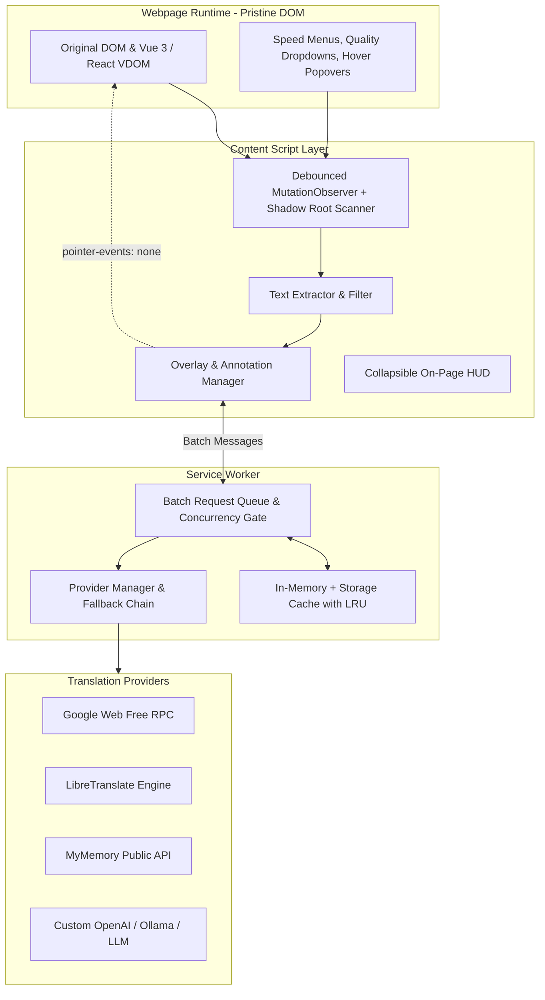

# 🌐 Universal Webpage Translator (Manifest V3)

> **A Free, Robust, Universal Webpage Translation Extension for Dynamic Web Applications (Bilibili, SPAs, React/Vue)**

Standard browser translation tools (such as Google Translate's built-in feature) frequently fail on modern web applications like **Bilibili**, **YouTube**, and complex Single-Page Applications (SPAs). They destructively modify or replace DOM text nodes, breaking React/Vue virtual DOM reconciliation with errors like `Uncaught NotFoundError: Failed to execute 'removeChild' on 'Node'`, destroying event listeners, and missing dynamically loaded dropdowns, popups, and comments.

**Universal Webpage Translator** solves this by decoupling the visual translation layer from the underlying website's application logic. It uses a **non-destructive visual overlay architecture** with `pointer-events: none`, meaning the website's original DOM and event listeners remain **100% intact**.

---

## 🎯 Key Architectural Advantages

| Feature | Standard Browser Translators | Universal Webpage Translator |
| :--- | :--- | :--- |
| **DOM Preservation** | Destructive (`<font>` tag injection / node replacement) | **Non-destructive** visual overlay / isolated annotations |
| **React / Vue 3 Safety** | Frequent crashes (`removeChild` / `insertBefore` errors) | **100% Immune**; original VDOM text node references untouched |
| **Dynamic Menus & Dropdowns** | Usually untranslated or breaks menu click events | **Real-time translation** within 16ms via debounced MutationObserver |
| **Interactivity** | Overwriting DOM breaks event listeners & focus | Full interactivity preserved via `pointer-events: none` |
| **Shadow DOM Support** | Ignored or inaccessible | **Recursive traversal** & sub-observers on open Shadow Roots |
| **Provider Fallback** | Locked to a single proprietary service | **Unified abstraction with automatic fallback chain** |
| **Caching** | Basic page cache | **Two-tier cache** (Memory L1 + Persistent L2 LRU Storage) |

---

## 🏗️ Architecture Overview



1. **Non-Destructive Visual Layering**:
   - Translations are rendered in `#universal-webtrans-overlay-container`, pinned to `document.documentElement` with `pointer-events: none !important;`.
   - All mouse clicks, hovers, drags, video scrubber interactions, and keystrokes pass directly to the website.
2. **Dynamic UI Detection**:
   - Listens to `childList` and visibility mutations (`style.display`, `class`, `aria-expanded`).
   - Translates Bilibili's player speed menus, quality selectors, user hover cards, and infinite-scroll comments immediately as they appear.
3. **Multi-Provider Engine Abstraction & Fallbacks**:
   - **Google Web (Free)**: Public high-speed client RPC with auto-detection.
   - **LibreTranslate**: Open-source self-hosted or public instances.
   - **MyMemory**: Free public translation API.
   - **Custom AI**: OpenAI-compatible endpoints (OpenAI, Ollama, Groq, DeepSeek).
   - If the primary provider hits a rate limit, the fallback chain immediately tries the secondary provider.
4. **Aggressive Two-Tier Caching**:
   - L1: High-speed in-memory map.
   - L2: Persistent `chrome.storage.local` with LRU eviction and 7-day TTL.
   - Drastically cuts latency and API usage on repetitive UI strings (e.g. "点赞", "收藏", "关注", "回复").

---

## 🚀 Quick Setup & Installation

### Step 1: Build the Extension
```bash
# Clone or navigate to the project directory
cd scratch/universal-web-translator

# Install dependencies
npm install

# Build the extension bundle
npm run build
```

The compiled, production-ready unpacked extension will be generated in `dist/`.

### Step 2: Load into Google Chrome / Microsoft Edge / Brave
1. Open your browser and navigate to:
   - Chrome: `chrome://extensions`
   - Edge: `edge://extensions`
2. Toggle **Developer mode** (top-right corner).
3. Click **Load unpacked** (top-left).
4. Select either:
   - The project folder directly: `universal-web-translator`
   - Or the `dist/` directory: `universal-web-translator/dist`
   *(Both directories contain all required bundles, manifests, and assets)*
5. The **Universal Webpage Translator** icon 🌐 will appear in your browser toolbar!

---

## ⚙️ Provider Configuration

You can configure translation engines and keys anytime in the **Extension Popup** or the **Options Page**:

### 1. Google Web (Free - Default)
- Requires **zero configuration** and **no API key**.
- Supports 100+ languages with automatic source language detection.

### 2. LibreTranslate
- Default instance: `https://libretranslate.de`
- Or point to your own local Docker container: `http://localhost:5000`
- Optional API key supported in Options.

### 3. Custom AI / Ollama / OpenAI
To use local LLMs (e.g. Ollama with `llama3` or `qwen2.5`) or OpenAI:
1. Open **Options** (`chrome://extensions` -> Details -> Extension options).
2. Set **API Endpoint URL**:
   - Ollama: `http://localhost:11434/v1/chat/completions`
   - OpenAI: `https://api.openai.com/v1/chat/completions`
3. Set **Model Name**: `llama3:8b`, `qwen2.5:7b`, or `gpt-4o-mini`.
4. Enter your API Key (leave empty for local Ollama).
5. Click **Save Settings**.

---

## 🧪 Testing & Bilibili Simulation Testbed

A complete real-world dynamic testbed is included in `test/bilibili-simulation.html`. It simulates:
- Bilibili Video Player with dynamic playback speed menus (`2.0x`, `1.5x`, `1.25x`, `1.0x 正常`, `0.5x`).
- Quality dropdown menu (`1080P 60帧 高清`, `720P 高清`, `480P 清晰`, `360P 流畅`).
- Live Danmaku canvas (filtered to prevent 60fps frame drops).
- Dynamic User Profile Hover Card (popover appended to `document.body` on hover).
- Dynamic comment section with infinite-scroll simulation ("加载更多评论").
- Shadow DOM custom component (`<custom-bili-card>`).
- Strict Vue 3 / React reactivity counter that throws an error if any child text node is detached or modified destructively.

### Running the Test Server:
```bash
node test/serve.js
```
Then visit `http://localhost:4173/test/bilibili-simulation.html` in your browser!

### Running Automated Unit Tests:
```bash
npx tsx test/unit-tests.ts
```

---

## 📁 Project Structure

```text
universal-web-translator/
├── dist/                      # Compiled unpacked Chrome extension
├── src/
│   ├── background/            # Background service worker (CORS-free fetch, caching, fallback)
│   ├── cache/                 # Two-tier L1 memory + L2 persistent storage cache
│   ├── content/               # Non-destructive overlay, MutationObserver, Floating HUD
│   ├── providers/             # Google Web, LibreTranslate, MyMemory, Custom AI providers
│   ├── popup/                 # Sleek dark-mode glassmorphic popup UI
│   ├── options/               # Advanced settings, API keys, fallback ordering
│   ├── types/                 # TypeScript interfaces
│   └── utils/                 # DOM filters, hash utilities, logger
├── test/
│   ├── bilibili-simulation.html # Interactive Bilibili DOM testbed
│   ├── unit-tests.ts          # Automated unit test suite
│   └── serve.js               # Local test HTTP server
├── manifest.json              # Chrome Manifest V3 configuration
├── package.json               # Dependencies and build scripts
└── build.js                   # Vite programmatic multi-entry builder
```

---

## 🔒 Privacy & Security
- Content scripts extract only human-readable UI strings, ignoring scripts, styles, codes, and passwords.
- No personal data or browsing history is tracked or stored.
- Custom API keys are stored locally on your device in `chrome.storage.local`.
