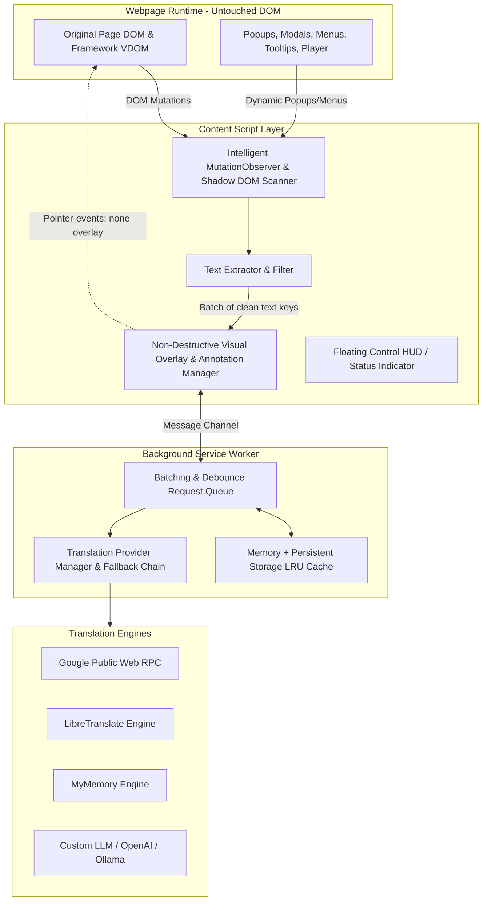

# Universal Webpage Translator — Implementation Plan

Build a free, robust, universal webpage translation browser extension (Manifest V3) specifically architected to solve the destructive DOM replacement issues that browser translation tools (such as Google Translate) have on modern dynamic websites like **Bilibili**, **YouTube**, and complex SPAs.

---

## Architectural Analysis & Technical Foundations

### 1. Proposed Architecture
The system consists of 4 isolated, decoupled layers:

- **Content Script**:
  - Listens to DOM insertions, attribute changes, and visibility transitions without polling.
  - Traverses open Shadow DOM roots recursively.
  - Extracts clean text nodes, placeholders, and tooltips while ignoring scripts, styles, code tags, URLs, and numbers.
  - Computes exact bounding boxes and renders high-performance overlays or CSS micro-annotations with `pointer-events: none` so that the original DOM is never restructured or severed from its Vue/React VDOM references.
- **Background Service Worker**:
  - Handles all network requests to bypass CORS limitations.
  - Manages request batching, rate-limiting, and debouncing.
  - Maintains persistent LRU storage cache (`chrome.storage.local`) and memory cache.
  - Implements provider fallback chaining (e.g. Primary -> Secondary -> Fallback).
- **Popup UI & In-Page HUD**:
  - Manifest V3 popup with sleek modern dark glassmorphic design.
  - Per-site translation toggle (domain whitelist/blacklist).
  - Provider selection and custom endpoint configuration.
  - Display modes: *Overlay Pill / Layer* (100% untouched DOM), *Inline Dual / Subtitle*, and *Hover Tooltip*.
  - Translation appearance controls (font size, opacity, badge style).

---

### 2. Browser Extension Limitations
- **Manifest V3 Service Worker Lifecycle**: Service workers become idle after 30 seconds of inactivity. To prevent state loss, all caching and provider states are backed by `chrome.storage.local` with in-memory hydration.
- **CORS in Content Scripts**: Content scripts in Manifest V3 cannot fetch arbitrary third-party endpoints. All translation API calls are routed through the background service worker using `chrome.runtime.sendMessage`.
- **Closed Shadow Roots**: Elements attached with `{ mode: 'closed' }` cannot have their `shadowRoot` inspected via JavaScript. The extension transparently logs/handles this and focuses on open Shadow Roots and standard DOM trees without throwing exceptions.
- **Cross-Origin Iframes**: Browsers enforce the Same-Origin Policy. Content scripts can run inside iframes if `all_frames: true` is configured in `manifest.json`, but script-to-script direct DOM traversal across origins is blocked. Each iframe runs its own isolated content script instance communicating via the background worker.

---

### 3. Handling Shadow DOM and Dynamic Popups/Iframes
- **Shadow DOM**:
  - When new nodes appear, the observer checks `if (node.shadowRoot)` and attaches a sub-`MutationObserver` to observe internal mutations within the shadow tree.
  - `document.querySelectorAll('*')` is augmented with a recursive traversal utility that inspects `.shadowRoot` across all custom elements.
- **Dynamic Popups, Dropdowns & Menus (Bilibili Player & Menus)**:
  - Bilibili attaches dropdowns (e.g. video speed `.bpx-player-ctrl-playbackrate-menu`, quality selector `.bpx-player-ctrl-quality-menu`, Danmaku settings modal, user avatar popover) directly to `document.body` or `#bilibili-player` upon hover/click.
  - The `MutationObserver` detects `childList` additions and `attributes` changes (such as `style.display`, `class`, or `aria-expanded`).
  - Upon appearance, the newly visible sub-tree is processed in less than 16ms (within 1 requestAnimationFrame) and translated immediately.
- **Infinite Scrolling & SPA Navigation**:
  - On URL changes (`popstate`, `pushState`, `replaceState` hooks) or dynamic router switches, the translation layer updates without requiring page reload.
  - For long comment threads, an `IntersectionObserver` gates translation so that off-screen items are only translated when scrolled into view, preventing network flooding.

---

### 4. Safest DOM-Preserving Translation Strategy
Why typical tools fail:
- Google Translate and standard translation extensions replace `node.nodeValue` or replace `Text` nodes with `` tags.
- In React/Vue, this breaks internal fiber / VDOM pointers. When Vue tries to run `parent.removeChild(oldNode)` or `parent.insertBefore(newNode, refNode)`, it throws:
  `NotFoundError: Failed to execute 'removeChild' on 'Node': The node to be removed is not a child of this node.`
- This immediately crashes Vue 3 reactive components (like Bilibili's video player, comment reply box, and user cards).

**Our Dual Non-Destructive Strategy**:
1. **Mode 1: Translation Overlay Layer (Zero DOM Disruption - Default & Recommended)**:
   - An independent overlay layer root (`#universal-webtrans-overlay-container`) is injected once into `document.documentElement`.
   - The overlay container has `pointer-events: none !important;` and `z-index: 2147483640;`.
   - For translated elements, lightweight visual badges or positioned overlay text are rendered directly over or adjacent to the original text.
   - All mouse clicks, drag events, hover states, and keyboard events pass cleanly through to Bilibili's underlying buttons and inputs.
   - **Original DOM nodes are 100% untouched.**
2. **Mode 2: Inline Dual / Subtitle Annotation (Non-Breaking Text Extension)**:
   - For article text or long comments, an inline annotation `` is appended after the text or displayed via CSS pseudo-element.
   - Elements are tagged with `data-webtrans-processed="true"` so `MutationObserver` ignores them, preventing infinite loops.
3. **Mode 3: Floating Interactive HUD & Hover Quick-Translate**:
   - Hovering over any dynamic icon, button, or menu item shows a rich glassmorphism translation tooltip in real time.

---

### 5. Why This Strategy Will Not Break Bilibili's UI
- **Video Player Controls**: Bilibili's custom player (`.bpx-player-container`, `bwp-video`) uses complex SVG icons and custom canvas layers. Our system never touches the player DOM hierarchy; overlays float above the player controls with `pointer-events: none` and synchronize with player resize / fullscreen events (`fullscreenchange`).
- **Vue 3 Reactivity**: Because original `Text` nodes and element hierarchies are preserved without replacing children, Vue's virtual DOM reconciliation never fails with `removeChild` errors.
- **Danmaku (Bullet Comments)**: The text filter identifies danmaku canvas/containers and excludes rapid transient animations from flooding the translation queue, preserving smooth 60fps playback.
- **Login Modals & Forms**: Input fields, validation handlers, and captcha challenges remain completely intact.

---

## User Review Required

> [!IMPORTANT]
> The project will be built with **TypeScript**, **Vite**, and **Manifest V3**, producing an unpacked extension ready to be loaded into Chrome / Edge (`chrome://extensions` -> *Load unpacked*).
> A mock/test harness page replicating Bilibili's dynamic DOM structures (dynamic quality menus, speed dropdowns, hover popovers, async comments, and Shadow DOM components) will be included for instant verification both in-browser and via automated tests.

---

## Proposed Changes

### Extension Project Setup (`scratch/universal-web-translator/`)

#### [NEW] `package.json`
- Vite, TypeScript, `@types/chrome`, `@crxjs/vite-plugin` (or custom robust Vite multi-entry build script for Chrome MV3).

#### [NEW] `tsconfig.json` & `vite.config.ts`
- Clean TypeScript configuration and multi-entry build configuration for:
  - `src/background/index.ts` (Service Worker)
  - `src/content/index.ts` (Content Script)
  - `src/popup/index.html` + `src/popup/popup.ts` (Popup Settings UI)
  - `src/options/index.html` + `src/options/options.ts` (Advanced Settings & Provider Config)

#### [NEW] `manifest.json`
- Manifest V3 compliant.
- Permissions: `storage`, `activeTab`, `scripting`.
- Host permissions: `<all_urls>` (or dynamic permissions for universal translation).
- `content_scripts` with `matches: ["<all_urls>"]`, `all_frames: true`, `run_at: "document_start"`.

---

### Core Translation Engine & Providers (`src/translation/`, `src/providers/`)

#### [NEW] `src/translation/types.ts`
- Interfaces for `TranslationProvider`, `TranslationRequest`, `TranslationResponse`, `LanguageConfig`, `TranslatorSettings`.

#### [NEW] `src/providers/BaseProvider.ts` & Provider Implementations:
- `GoogleWebProvider.ts`: High-performance public translation RPC with multi-language auto-detect.
- `LibreTranslateProvider.ts`: Compatible with public or self-hosted LibreTranslate instances.
- `MyMemoryProvider.ts`: Free public translation API with quota handling.
- `CustomAPIProvider.ts`: Supports user-configured OpenAI / Ollama / DeepL / custom JSON API endpoints.
- `ProviderManager.ts`: Orchestrates provider selection, automatic fallback chains, request throttling, and retry logic.

---

### Intelligent Caching & Batching Engine (`src/cache/`, `src/translation/batcher.ts`)

#### [NEW] `src/cache/TranslationCache.ts`
- Two-tier caching:
  - L1: High-speed in-memory `Map` with composite key `[srcLang]_[tgtLang]_[provider]_[hash]`.
  - L2: Persistent `chrome.storage.local` with LRU eviction and timestamp expiration.
- Methods: `get()`, `set()`, `getMany()`, `setMany()`, `clear()`, `getStats()`.

#### [NEW] `src/translation/batcher.ts`
- Batches pending texts with configurable window (e.g. 60ms) and max batch size (e.g. 30 strings).
- Deduplicates identical strings within the same batch.
- Dispatches batch requests to background service worker.

---

### Non-Destructive DOM & Dynamic Detection Engine (`src/content/`)

#### [NEW] `src/content/textExtractor.ts`
- Smart filtering: ignores `<script>`, `<style>`, `<noscript>`, `<code>`, `<pre>`, URLs, numbers, SVGs, canvas, danmaku containers.
- Extracts human-readable text from text nodes, `placeholder`, `title`, `aria-label`.
- Avoids already translated or marked nodes (`data-webtrans-processed`).

#### [NEW] `src/content/mutationManager.ts`
- Intelligent `MutationObserver` configuration:
  - Debounced observation.
  - Ignores mutations produced by the translator's own overlay container (`#universal-webtrans-root`).
  - Monitors `childList` additions and attribute changes on dynamic popups, dropdowns, and modals.
  - Scans and attaches observers to open Shadow DOM roots recursively.
  - Handles SPA route changes (`history.pushState`, `hashchange`).

#### [NEW] `src/content/overlayManager.ts`
- Manages the isolated visual translation layer:
  - Attached outside the application's React/Vue component tree.
  - Uses `pointer-events: none` to guarantee that all native user interactions (clicks, hovers, drags, keystrokes) reach the original elements.
  - Supports:
    1. **Overlay Layer Mode**: Precise floating badges/labels positioned via `getBoundingClientRect()`.
    2. **Inline Subtitle Mode**: Non-intrusive non-breaking annotations.
    3. **Hover Tooltip Mode**: Sleek instant translation tooltip.
  - Auto-repositions on window resize, scroll, and player fullscreen events.

#### [NEW] `src/content/floatingHUD.ts`
- Minimalist, collapsible glassmorphic floating control pill on page corner:
  - Quick Translate toggle (Active / Paused).
  - Target language quick-switcher.
  - Status indicator (Translating / Cached / Idle).

---

### User Interface & Extension Management (`src/popup/`, `src/options/`)

#### [NEW] `src/popup/popup.html`, `popup.css`, `popup.ts`
- Premium dark-mode glassmorphic UI:
  - Source Language (Auto Detect / Manual) -> Target Language selector.
  - Translation Engine dropdown (Google Web Free, LibreTranslate, MyMemory, Custom API).
  - Translation Mode switcher (Overlay Layer vs Inline vs Hover Tooltip).
  - Dynamic content toggles (Popups/Dropdowns, Tooltips, Placeholders).
  - Current site toggle (e.g. Enable/Disable for `bilibili.com`).
  - Cache stats & Clear Cache action.

#### [NEW] `src/options/options.html`, `options.ts`
- Advanced provider configurations (Custom LibreTranslate instance URL, Custom API keys, fallback ordering, styling options: font size, opacity, color scheme).

---

### Real-World Dynamic Test Suite (`test/bilibili-simulation.html`)

#### [NEW] `test/bilibili-simulation.html`
- A comprehensive interactive testbed reproducing Bilibili's challenging dynamic structures:
  1. Video player with playback speed menu (0.5x, 1.0x, 1.25x, 1.5x, 2.0x) generated on hover/click.
  2. Quality selector dropdown (1080P 高清, 720P 高清, 480P 清晰) dynamically appended to body.
  3. Interactive Danmaku toggle button with dynamic tooltip.
  4. Dynamic comment section with "Load More Comments" (infinite scroll simulation).
  5. User profile hover card (popover rendered on mouseenter).
  6. Login/Feedback modal dialog dynamically created and destroyed.
  7. Web Component with open Shadow DOM containing untranslated Chinese text.
  8. React/Vue-style strict reactive counter where replacing child nodes would throw an unhandled exception.

---

## Verification Plan

### Automated Build & Unit Tests
1. Run `npm install` and `npm run build` to ensure zero TypeScript errors and clean extension bundle generation in `dist/`.
2. Run test script verifying:
   - Translation engine abstraction and fallback chaining.
   - Cache key generation, L1/L2 storage, and hit/miss behavior.
   - Text extraction filter (ignoring scripts, numbers, URLs, and code).

### Interactive Browser Verification
1. Launch the `test/bilibili-simulation.html` page using a local HTTP server.
2. Verify that:
   - Initial static Chinese text is translated to English without altering original element event listeners.
   - Opening the dynamic speed menu, quality menu, and hover popover immediately translates the newly revealed options.
   - Clicking buttons, toggles, and typing into input fields works 100% without any `removeChild` or VDOM errors.
   - Clicking "Load More Comments" dynamically translates newly injected comments.
   - Shadow DOM elements are translated properly.
   - Overlays pass clicks through to underlying controls (`pointer-events: none`).
3. Document walkthrough with screenshots and verification steps.
